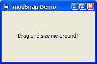



## Multi\-Monitor Compatible Window/Screen/Desktop Snap/Stick/Dock

### Description

This module allows any form to snap to the edges of the work area. (Kinda like winamp) It is multi-monitor compatible. (not kinda like winamp)
 
### More Info
 
This code works best when used with a decent subclassing library (like MsgBlaster), rather than with VB's crappy built in functions. It only works on Win98+, because of the Multi-monitor compatability.

             |
---                |---
**Submitted On**   |2003-01-12 18:34:16
**By**             |[Imran Hameed](https://github.com/Planet-Source-Code/PSCIndex/blob/master/ByAuthor/imran-hameed.md)
**Level**          |Intermediate
**User Rating**    |5.0 (20 globes from 4 users)
**Compatibility**  |VB 6\.0
**Category**       |[Custom Controls/ Forms/  Menus](https://github.com/Planet-Source-Code/PSCIndex/blob/master/ByCategory/custom-controls-forms-menus__1-4.md)
**World**          |[Visual Basic](https://github.com/Planet-Source-Code/PSCIndex/blob/master/ByWorld/visual-basic.md)
**Archive File**   |[Multi\-Moni1528171122003\.zip](https://github.com/Planet-Source-Code/imran-hameed-multi-monitor-compatible-window-screen-desktop-snap-stick-dock__1-42382/archive/master.zip)

